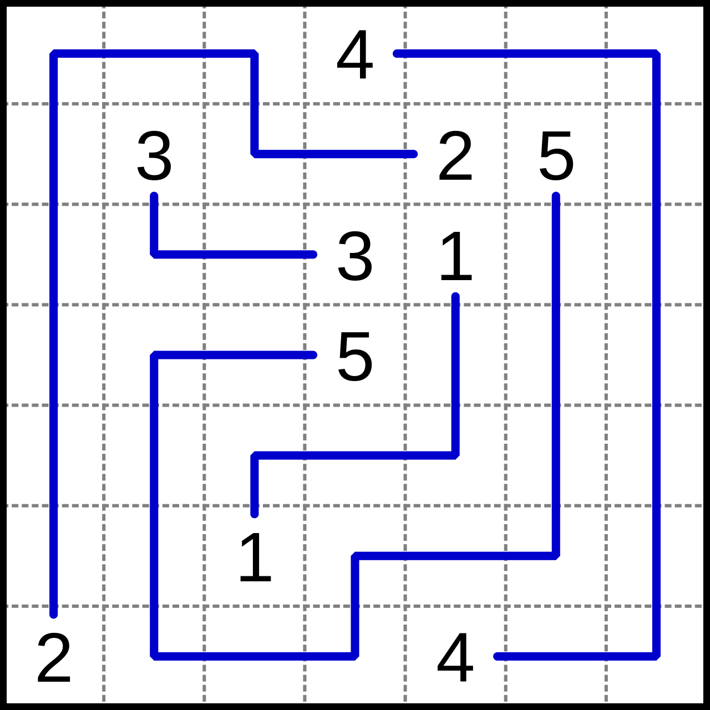
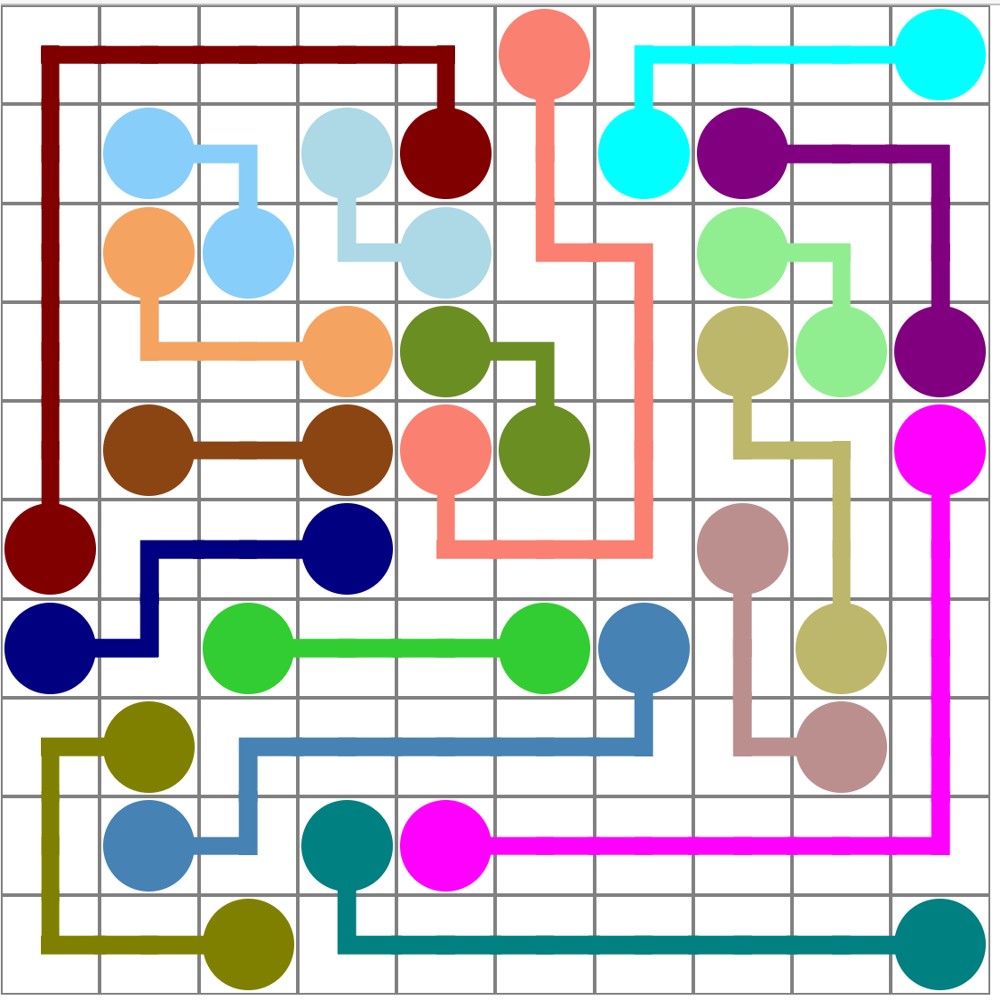
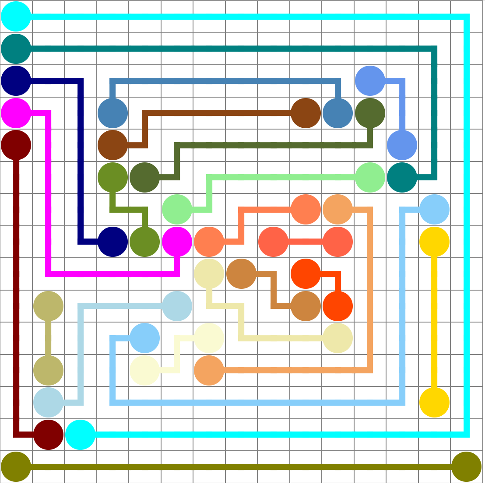

# flow
The idea is to create a generator for numberlink puzzles.
In order to be classified as a valid puzzle each board must follow a set of rules:
1. The board must be fully filled by paths
2. Each path must have a single start and a single end
3. Each path must be at least 3 cells long
4. A cell may not be adjacent with more than two cells of the same path
<table>
  <tr>
    <td></td>
    <td></td>
  </tr>
</table>

Generated examples created with this repo:
<table>
  <tr>
    <td></td>
    <td></td>
  </tr>
</table>

How to run:
1. `cd flow`
2. `npm install`
3. `npm run start`

in a second terminal:
1. `cd flow`
2. `cd client`
3. `npm run start`
